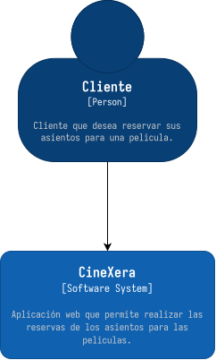
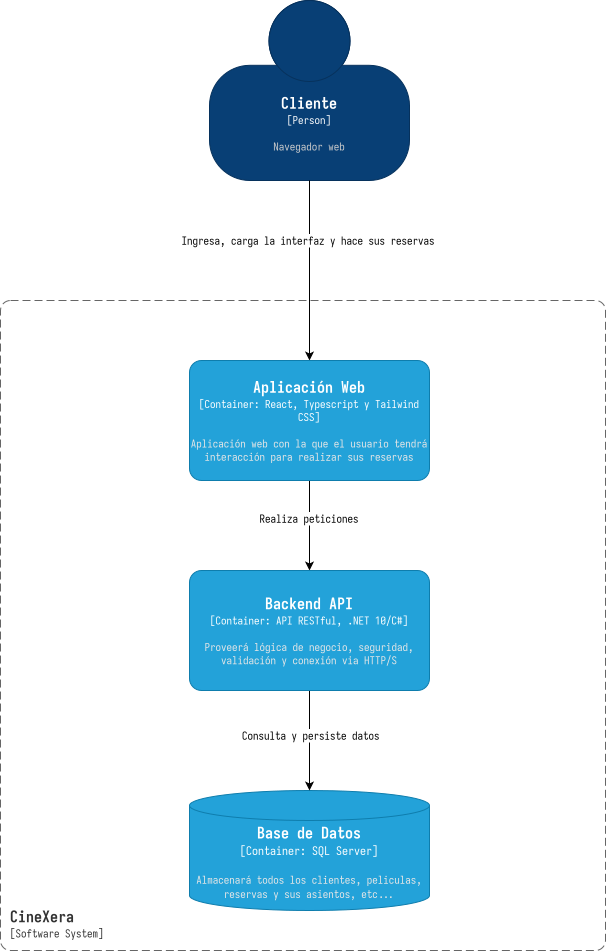
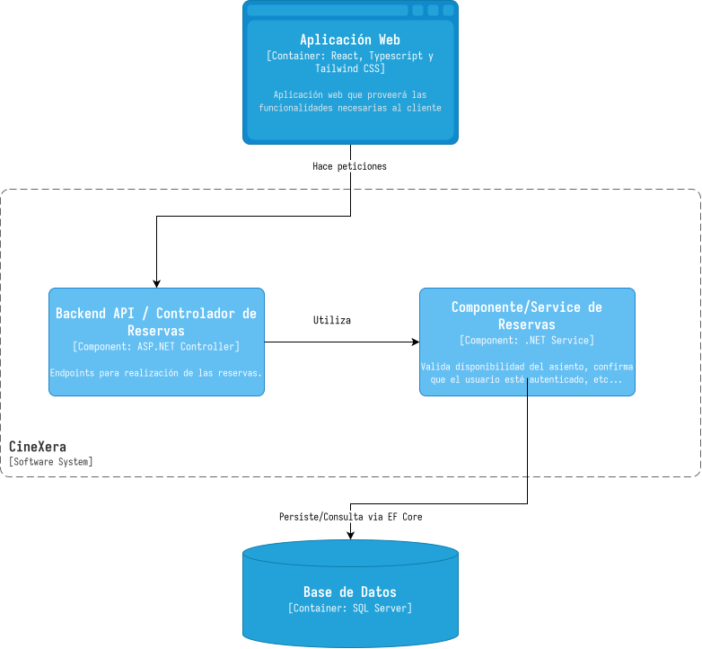

# Documento de Arquitectura de Software 

Este documento comprende los detalles a nivel técnico sobre el sistema
**CineXera**

## 1. Introducción

### 1.1 Propósito

Este documento tiene como propósito definir y mostrar la Arquitectura de Software que se estará utilizando en el sistema CineXera, en el cual se ofrecerá una vista general y también una vista con el modelo C4 el cual he elegido porque considero que con estos 4 diagramas puedo mostrar y abarcar toda la arquitectura que se utilizará.

### 1.2 Alcance

En este documento se mostrará la arquitectura técnica del sistema. Contando con una sola aplicación Web desarrollada con tecnologías como React, Typescript, ASP.NET Core, etc...

Se especificará la descomposición del sistema completo utilizando el modelo C4 detallando como se conecta todo, adicionalmente se podrá observar una alta oportunidad de escalabilidad en un futuro al pensar en un sistema desacoplado.

---

## 2. Módelo C4

### 2.1 Diagrama de Contexto, C1

### 2.2 Diagrama de Contenedores, C2

### 2.3 Diagrama de Componentes, C3

### 2.4 Diagrama de Código

---

## 3. Base de Datos

### 3.1 Diagrama Entidad Relación - Chen

### 3.2 Diagrama Modelo Relacional

---

## 4. Decisiones Aruitectónicas

---

## 5. Riesgos Técnicos y Mitigaciones